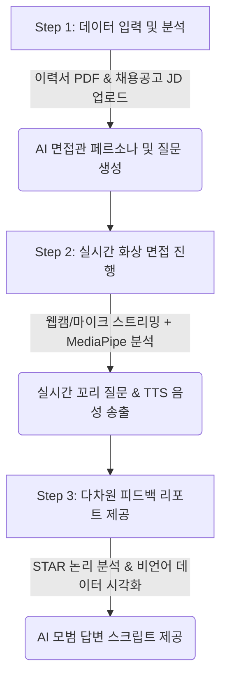
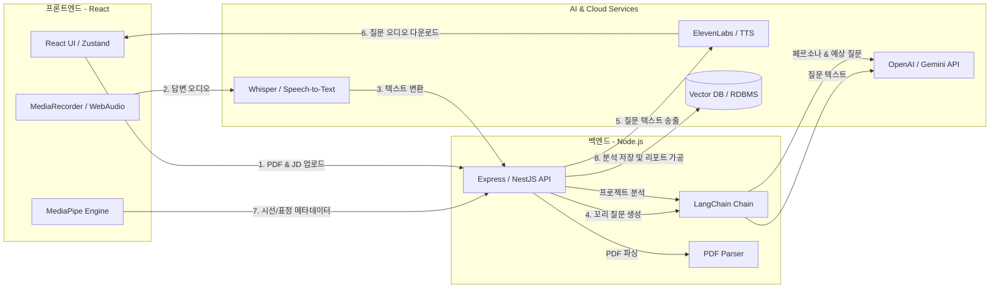
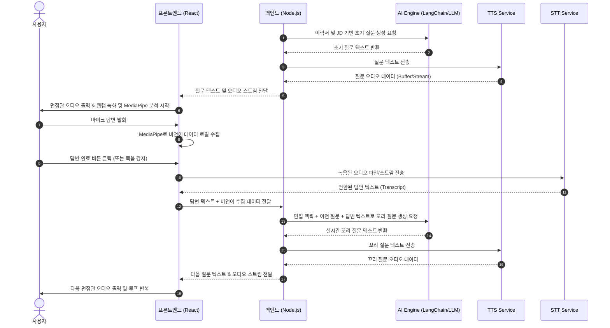

# 🎤 pre-terview (Interview Echo)
> **실시간 AI 화상 면접 진행 및 다차원 피드백 분석 서비스**
> 혼자 하는 면접 연습을 넘어, AI 면접관과의 실시간 상호작용과 다차원 답변 분석 리포트를 통해 면접 역량을 극대화합니다.

---

## 📌 1. 서비스 개요 (Overview)

### 1.1 기획 배경
- **답변의 객관적 검증 한계:** 취업 준비생과 이직 준비자들은 자신의 면접 답변이 논리적인지, 비언어적 태도(시선, 표정 등)가 적절한지 스스로 평가하기 어렵습니다.
- **실전 감각 부족:** 텍스트 기반의 AI 모의 면접은 실제 화상 면접에서 느끼는 긴장감과 즉흥적인 압박 질문에 대한 대처 능력을 기르기 어렵습니다.
- **피드백의 부재:** 면접 스터디는 전문성이 부족할 수 있고, 유료 컨설팅은 비용적 부담이 큽니다.

### 1.2 서비스 정의
**pre-terview**는 웹캠과 마이크를 통해 실시간으로 AI 면접관과 대화하고, 면접이 끝난 후 사용자의 답변 내용(논리 구조)과 비언어적 요소(시선 처리, 표정, 발화 속도)를 종합 분석하여 시각화된 리포트를 제공하는 **AI 면접 shadowing & 피드백 플랫폼**입니다.

### 1.3 비즈니스 모델 (Monetization)
- **Free Tier (기본 제공):** 최초 1회 무료 모의 면접 진행 및 기본 분석 요약 리포트 제공.
- **무제한 연습권 (구독 모델):** 주간/월간 구독 시 AI 면접 무제한 진행 및 면접관 페르소나 다양화 옵션 제공.
- **정밀 분석 리포트 (건당 판매):** STAR 기법 세부 채점, 발화 속도 및 시선 처리 상세 타임라인, AI가 재구성한 모범 답변 스크립트를 포함한 PDF/웹 리포트 소장권.

### 1.4 핵심 기능 및 개발 핵심 포인트
- **핵심 기능:**
  - **꼬리 질문 생성:** 사용자의 답변을 실시간으로 분석해 압박 면접 질문을 던지는 기능.
  - **논리 구조 시각화:** 답변 내용을 '두괄식 여부', '근거의 적절성' 등으로 나누어 점수화.
  - **비언어 분석:** 웹캠을 통해 시선 처리나 미소 등을 분석 (MediaPipe API 등의 경량 AI 라이브러리로 구현).
- **개발 포인트:**
  - WebRTC 및 MediaStream API를 활용한 실시간 음성/영상 스트리밍 처리.
  - LLM 프롬프트를 활용한 면접관 페르소나 설정.

---

## ⚙️ 2. 핵심 기능 및 서비스 플로우 (Core Features & Flow)



### 2.1 Step 1: 데이터 입력 및 맞춤형 프롬프트 생성 (Input Phase)
사용자가 면접 환경을 세팅하기 위해 필요한 데이터를 입력하는 단계입니다.
- **지원 회사 및 직무 정보:** 회사명, 직무명, 채용 공고(JD) 텍스트 입력.
- **사용자 정보:** 이력서 및 포트폴리오 파일(PDF 등) 업로드.
- **백엔드 처리 로직:**
  1. `pdf-parse` 라이브러리를 사용해 업로드된 PDF에서 이력 텍스트를 추출합니다.
  2. 추출된 텍스트와 JD 텍스트를 LLM(LangChain 활용)에 주입합니다.
  3. 요구 역량과 사용자의 실제 경험 간의 교차 분석(Gap Analysis)을 수행합니다.
  4. 면접관의 페르소나(예: 꼼꼼한 테크 리더, 엄격한 PM, 부드러운 HR 담당자)를 설정하고, 이력서 기반 **초기 맞춤형 질문 리스트(5문항)**를 동적으로 빌드합니다.

### 2.2 Step 2: 실시간 화상 면접 진행 (Interview Phase)
실제 화상 면접과 동일한 환경을 브라우저 상에 구현합니다.
- **인터페이스:** 화면 중앙에 사용자의 로컬 웹캠 화면이 송출(MediaStream API)되고, 화면 한편에는 가상의 면접관 상태를 나타내는 UI(음성 파형 애니메이션 및 타이머 등)가 위치합니다.
- **비언어적 요소 실시간 분석 (Edge-side AI):**
  - 영상 데이터를 서버로 직접 스트리밍하면 네트워크 대역폭과 서버 비용이 급증하므로, 클라이언트 브라우저에서 MediaPipe(Face Landmarker/Mesh)를 실행합니다.
  - 시선 방향(카메라 응시 여부), 머리 각도, 주요 표정 데이터를 프레임당 추출하고, 이 메타데이터 포인트들만 로컬 상태에 저장하거나 백엔드로 가볍게 전송합니다.
- **질문 생성 및 음성 송출:** LLM이 생성한 텍스트 질문을 TTS(Text-to-Speech) API를 통해 음성(고음질 오디오 스트림)으로 합성하여 브라우저에서 재생 및 전달합니다.
- **실시간 꼬리 질문:** 사용자가 답변을 시작하면 마이크 입력을 녹음하고, Web Speech API 또는 Whisper API를 활용해 실시간으로 텍스트(STT)화합니다. 답변이 완료되면 STT 변환 텍스트를 백엔드로 전달하고, LLM은 해당 답변의 논리적 허점, 구체적인 기술 스택, 포트폴리오 내 프로젝트 기여도 등을 파고드는 예리한 압박 질문(꼬리 질문, Follow-up Question)을 실시간으로 생성하여 질문 루프를 이어갑니다.

### 2.3 Step 3: 다차원 피드백 리포트 제공 (Report Phase)
면접 종료 후, 정량적이고 정성적인 데이터를 대시보드 형태로 시각화하여 제공합니다.
- **논리 구조 분석:** 사용자의 답변을 분석하여 STAR(상황 Situation, 과제 Task, 행동 Action, 결과 Result) 기법에 부합하는지 평가하고 점수화합니다. (예: "행동은 구체적이나, 그에 따른 정량적 결과에 대한 설명이 부족합니다.")
- **비언어적 요소 분석:** 면접 중 시선 처리(카메라 응시 비율), 표정 변화(긴장 수준 추이), 발화 속도(WPM) 및 불필요한 필러 워드(Filler Words) 감지 횟수를 타임라인 그래프로 시각화합니다.
- **개선 방향 제시:** 사용자의 원래 답변 스크립트와 면접관의 질문 의도를 바탕으로, STAR 기법을 완벽히 적용해 면접관의 의도에 부합하도록 재구성한 **AI 추천 모범 답변 스크립트**를 대조하여 제안합니다.

---

## 🏗️ 3. 시스템 아키텍처 및 데이터 흐름 (Architecture & Data Flow)

### 3.1 전체 시스템 아키텍처



### 3.2 실시간 대화 시퀀스 다이어그램



---

## 🛠️ 4. 기술 스택 (Technology Stack)

### Frontend
- **Framework:** React 18+ (Vite)
- **Language:** TypeScript
- **State Management:** Zustand (가볍고 직관적인 전역 상태 관리 및 WebRTC 상태 바인딩)
- **Styling:** Vanilla CSS / CSS Modules (스타일 캡슐화 및 최적의 레이아웃 제어)
- **Computer Vision:** `@mediapipe/tasks-vision` (실시간 Face Landmarker)
- **Data Visualization:** Recharts 또는 Chart.js (리포트 대시보드 시각화)
- **Assets & Icons:** Lucide React, Lottie-web (오디오 파형 및 로딩 애니메이션)

### Backend
- **Runtime:** Node.js (v18+)
- **Framework:** Express 또는 NestJS (TypeScript 적용)
- **File Parsing:** `pdf-parse` (포트폴리오/이력서 PDF 파싱)
- **AI Orchestration:** LangChain (LLM 체인 설계 및 메모리 기반 대화 관리)
- **Database:** Prisma (ORM), PostgreSQL / MongoDB (면접 이력, 세션 및 분석 리포트 저장)

### AI & Cloud Services
- **LLM:** OpenAI GPT-4o (또는 Gemini 1.5 Pro)
- **STT (Speech-to-Text):** OpenAI Whisper API 또는 Google Cloud Speech-to-Text
- **TTS (Text-to-Speech):** OpenAI TTS API 또는 ElevenLabs (고품질 페르소나 음성 지원)
- **Storage:** AWS S3 (이력서 PDF 보관 및 리포트 이미지 저장)

---

## 📂 5. 디렉토리 구조 설계 (Directory Structure)

```text
pre-terview/
├── frontend/                  # React Vite App
│   ├── public/
│   └── src/
│       ├── assets/            # 이미지, Lottie 애니메이션 파일
│       ├── components/        # 공통 UI 컴포넌트 (Button, Card, Modal 등)
│       │   └── feedback/      # 리포트 시각화 전용 컴포넌트
│       ├── hooks/             # 커스텀 훅 (useMediaPipe, useWebRTC 등)
│       ├── pages/             # 페이지 컴포넌트
│       │   ├── Home.tsx       # 메인 / 랜딩 페이지
│       │   ├── Setup.tsx      # 이력서 업로드 및 회사 설정
│       │   ├── Interview.tsx  # 실시간 화상 면접 진행실
│       │   └── Report.tsx     # 피드백 분석 리포트 페이지
│       ├── store/             # Zustand 전역 상태 저장소
│       ├── styles/            # Vanilla CSS 전역 및 공통 스타일
│       ├── utils/             # WebRTC, 오디오 헬퍼 유틸리티
│       ├── App.tsx
│       └── main.tsx
│
├── backend/                   # Node.js Express/NestJS Server
│   ├── src/
│   │   ├── config/            # 환경 변수 및 외부 서비스 설정
│   │   ├── controllers/       # API 엔드포인트 핸들러
│   │   ├── services/          # 비즈니스 로직 (PDF 파싱, AI 질문 생성 등)
│   │   │   ├── ai.service.ts  # LangChain 기반 LLM 프롬프트/체인 처리
│   │   │   └── pdf.service.ts # pdf-parse 처리
│   │   ├── middlewares/       # 인증, 파일 업로드(Multer) 필터
│   │   ├── models/            # DB 스키마 (Prisma/Mongoose)
│   │   ├── routes/            # 라우팅 테이블
│   │   └── app.ts             # Express 앱 엔트리
│   ├── package.json
│   └── tsconfig.json
│
└── README.md                  # 본 문서
```

---

## 🔌 6. API 및 실시간 프로토콜 설계 (API & WebSocket Draft)

### 6.1 HTTP REST API

#### 1) 면접 세션 초기화 및 이력서 분석
- **Endpoint:** `POST /api/sessions`
- **Content-Type:** `multipart/form-data`
- **Request Body:**
  - `resume`: File (PDF)
  - `companyName`: String
  - `jobTitle`: String
  - `jobDescription`: String
- **Response:**
  ```json
  {
    "sessionId": "sess_8f9c2d1b4a0e",
    "persona": {
      "name": "David (Senior Tech Lead)",
      "tone": "꼼꼼하고 기술적인 디테일을 중점적으로 확인하는 면접관"
    },
    "firstQuestion": {
      "questionId": "q_001",
      "text": "안녕하세요, 이력서에 작성해주신 마이크로서비스 아키텍처 전환 프로젝트에 대해 관심이 많습니다. 이 프로젝트에서 본인이 담당했던 역할과 그 과정에서 가장 해결하기 어려웠던 기술적 장애물은 무엇이었나요?"
    }
  }
  ```

#### 2) 피드백 리포트 조회
- **Endpoint:** `GET /api/sessions/:sessionId/report`
- **Response:**
  ```json
  {
    "sessionId": "sess_8f9c2d1b4a0e",
    "summary": "전반적으로 두괄식 답변 태도를 보였으나, 구체적인 수치 제시(Result)가 부족합니다.",
    "scores": {
      "logic": 82,
      "nonVerbal": 78,
      "vocabulary": 85
    },
    "starAnalysis": [
      {
        "questionId": "q_001",
        "question": "프로젝트에서 가장 해결하기 어려웠던 기술적 장애물...",
        "answer": "...",
        "feedback": {
          "situation": "과거 모놀리식 구조의 병목 문제를 명확히 짚었습니다.",
          "task": "본인의 해결 목표를 구체적으로 설정했습니다.",
          "action": "Redis 분산 락 도입 부분이 명확합니다.",
          "result": "성능이 얼마나 개선되었는지 정량적 지표(TPS 등)가 누락되었습니다."
        },
        "suggestedAnswer": "당시 1,000 TPS 상황에서 발생한 세션 병목을 상황으로 명시하고..."
      }
    ],
    "nonVerbalMetrics": {
      "eyeContactRatio": 84.5,
      "speedWpm": 115,
      "silenceDurationSeconds": 12.4,
      "facialExpressionSummary": "안정적인 표정을 유지하였으나 중반부 기술 꼬리 질문 시 입꼬리가 긴장되는 모습을 보임."
    }
  }
  ```

---

## 🗺️ 7. 개발 로드맵 (Roadmap)

### Phase 1: MVP 개발 (핵심 파이프라인 검증)
- [x] Backend: PDF 텍스트 추출 및 LangChain 이력서-JD 분석 체인 구축.
- [x] Frontend: 마이크/카메라 제어 인터페이스 설계 및 오디오 녹음 기능 구현.
- [x] AI Integration: OpenAI/Gemini API 연동을 통한 대화 프로토타입 작성 (인메모리 세션 관리 연동).
- [x] UI/UX: FSD 아키텍처 기반의 프론트엔드 모듈화 및 전체 면접 화면 연동 퍼블리싱 완료.

### Phase 2: 비언어 분석 및 분석 정밀화
- [x] Frontend: MediaPipe Face Landmarker 연동 및 시선 이탈 감지 알고리즘 구현 (시뮬레이션 fallback 포함).
- [x] Backend: STAR 기법 기반의 답변 다차원 채점 프롬프트 고도화 (정량 지표 중심 감점 요인 강화).
- [x] UI/UX: 다차원 리포트 대시보드 내 실시간 비언어 모니터링 추이 SVG Area Chart 시각화 추가.

### Phase 3: 실시간 스트리밍 고도화 및 최적화
- [x] Backend-Frontend: SSE(Server-Sent Events)를 통한 실시간 꼬리 질문 스트리밍(Chunk 단위 출하) 구현 및 응답 시간 최적화 완료.
- [ ] Frontend: 마이크 오디오 입력 기반 실시간 STT(Speech-to-Text) 파이프라인 구축 (현재 데모 시뮬레이션 목적의 기정의 텍스트 답변 제출 모델에서 Web Speech API / Whisper 연동으로 고도화 예정).
- [ ] Performance: MediaPipe 로컬 오버헤드 최적화 (FPS 조절을 통한 CPU 점유율 하향 조정).
- [ ] 완성도 검증: 모의 면접 테스트 베드 구축 및 실제 사용자 피드백 반영.

---

## 🚀 8. 시작 및 로컬 실행 가이드 (Getting Started)

프로젝트를 로컬 컴퓨터에서 동시에 구동하기 위한 가이드입니다. 

### 8.1 요구 환경 (Requirements)
- **Node.js:** v18.0.0 이상 권장
- **npm:** v9.0.0 이상 권장

### 8.2 환경 변수 설정
백엔드 연동 및 실제 AI(OpenAI GPT-4o) 면접 질문 생성을 위해 백엔드 경로에 환경 변수 키 설정이 필요합니다.
1. `/backend` 경로의 `.env.example` 파일을 복사하여 `.env` 파일을 생성합니다.
2. 발급받은 `OPENAI_API_KEY`를 추가합니다. (설정하지 않을 시 Mock 데이터 기반의 시뮬레이션 모드로 작동합니다.)

```bash
cd backend
cp .env.example .env
# .env 파일을 열고 OPENAI_API_KEY=your_key_here 작성
```

### 8.3 서버 및 클라이언트 동시 실행
프론트엔드와 백엔드가 서로 다른 포트에서 작동하므로 각각의 터미널 탭에서 실행해 주어야 합니다.

#### Tab 1: 백엔드 서버 시작 (Port: 5001)
```bash
cd backend
npm install
npm run dev
```

#### Tab 2: 프론트엔드 클라이언트 시작 (Port: 5173)
```bash
cd frontend
npm install
npm run dev
```

모든 서비스가 켜지면 브라우저에서 `http://localhost:5173`으로 접속하여 맞춤형 AI 면접 및 실시간 비언어 피드백 환경을 확인하실 수 있습니다.
